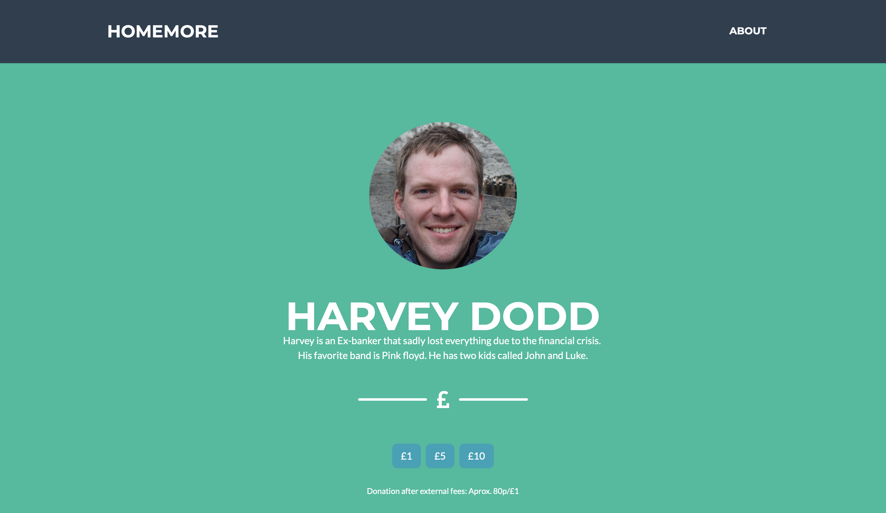
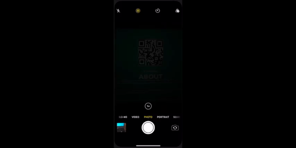

# Home More - A donation platform

[](https://ashleybuckingham.co.uk)


# [DEMO](https://donate.ashleybuckingham.co.uk)

Inspired by a challenge by a very good friend. A proof of concept utilizing stripe payment system to enable easy donations to the homeless in a ever growing cashless society.



## Features



- Easy QR Code donation
- No app download required
- No account setup needed
- Support for all major cards
- Apple pay Support
- Google Pay Support
- Stripe payment integration
- Completed as part of a one-day challenge...

## Setup And Installation

### Clone Repo 
```
git clone git@github.com:Cur50r/home-more.git
cd home-more
```

### Set up credentials

- Create a .env file based on .env.example 
- Get API keys from stripe
- Fill in your API Keys in the .env file

### Run standalone

1. Install dependencies

    ```npm install```

2. Run the application

    ```npm start```

### Run Docker

1. Build image

    ```docker build -t home-more .```

2. Run image

    ```docker run --env-file .env -p 2222:2222 home-more```

### Open App
Open [`http://localhost:2222`](http://localhost:2222) in browser

## Contributing

Pull Requests are welcome!

## Other Projects

[Please check out my other projects on my portfolio.](https://ashleybuckingham.co.uk)